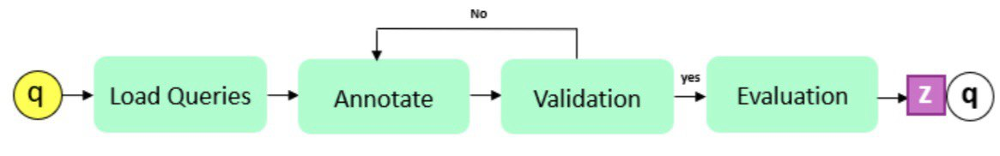
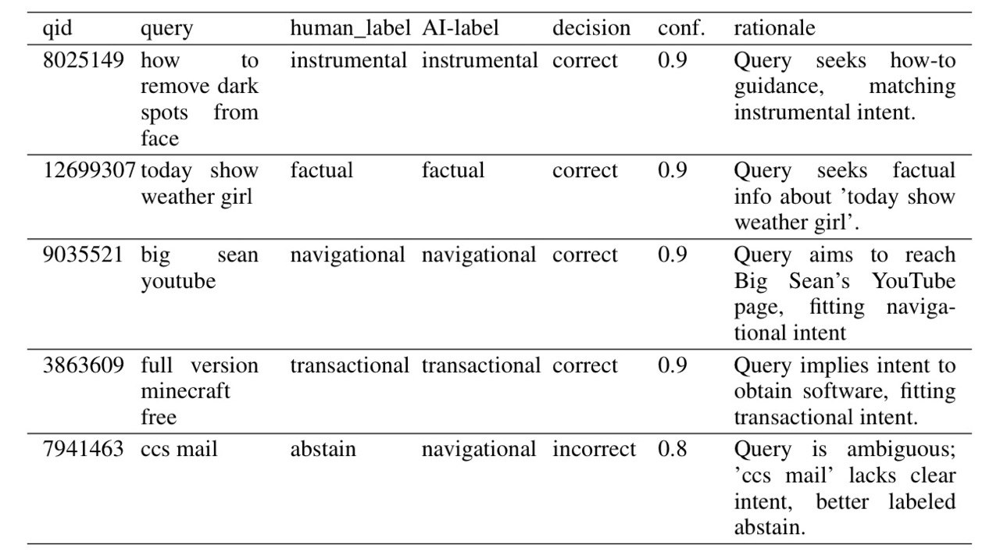
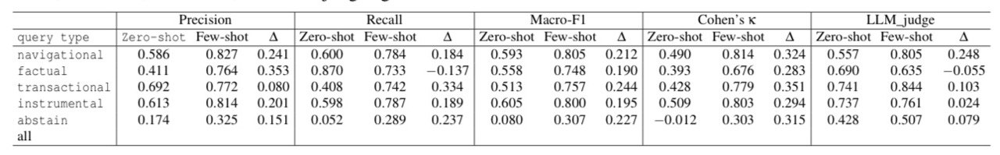
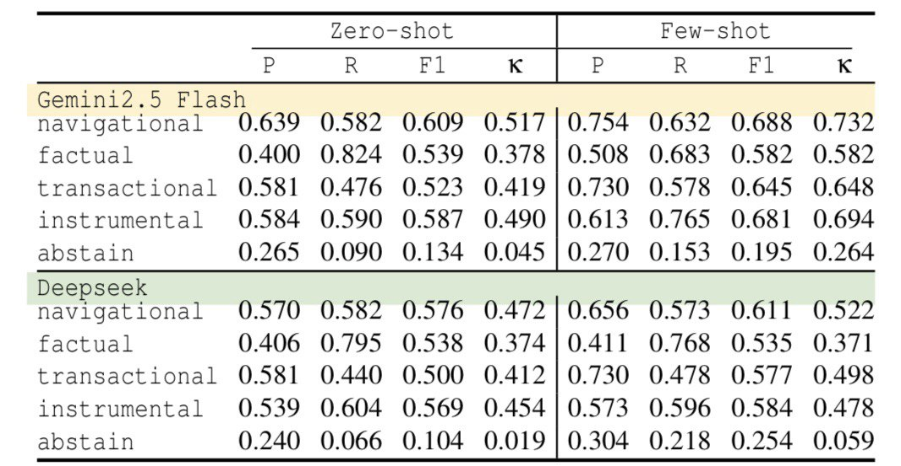
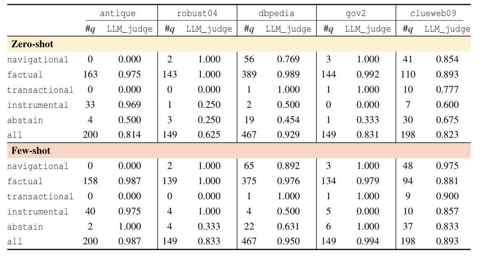

# Automatic Query-Intent Annotation: A Log-Free Agentic LLM Framework
Short and ambiguous queries remain a major challenge for search engines, often reducing the effectiveness of information retrieval (IR) systems. Prior work shows that identifying a query's intent, such as navigational, informational, or transactional, can significantly improve retrieval accuracy and interpretability. However, most intent-labeling methods depend on user search-log histories, which not only require extensive collection and preprocessing but also introduce substantial privacy and data provenance concerns, limiting their availability to researchers and their deployability in privacy-sensitive domains. This paper introduces a log-free, agentic annotation framework that uses a pipeline of LLM-driven agents to automatically assign intent labels to queries. The system comprises four components: a loader, an LLM-based annotator (zero-shot or few-shot), a validator enforcing structural and confidence constraints, and an evaluator that compares predictions against gold labels when available or uses an LLM-as-judge otherwise. We adopt a five-class taxonomy (navigational, factual, transactional, instrumental, and abstain) and evaluate the approach on labeled data (orcas-i-2m) as well as unlabeled benchmarks, including antique, clueweb09-b, robust04, gov2, and dbpedia. Empirical results show that the few-shot variant consistently outperforms zero-shot prompting, and that the end-to-end pipeline maintains stable cross-domain performance under GPT-5-based auditing. Because the framework operates without relying on user interaction logs, it significantly reduces privacy exposure while lowering annotation cost and improving scalability. Automating query-intent annotation avoids dependence on user search logs, thereby mitigating privacy risks while reducing the time and cost of labeling large-scale datasets.
### Workflow

### Example of LLM-judge (GPT-5-Pro) evaluations

### Results
Performance of the agentic annotator under zero-shot and few-shot prompting regimes by query type. Each intent
category is evaluated on a balanced sample of 1,000 queries (total number of queries is 5,000). The table reports precision,
recall, macro-F1, Cohen’s κ, and LLM-judge agreement.

Annotation performance of Gemini 2.5 Flash and DeepSeek-V1.

Cross-domain annotation performance across different datasets.

